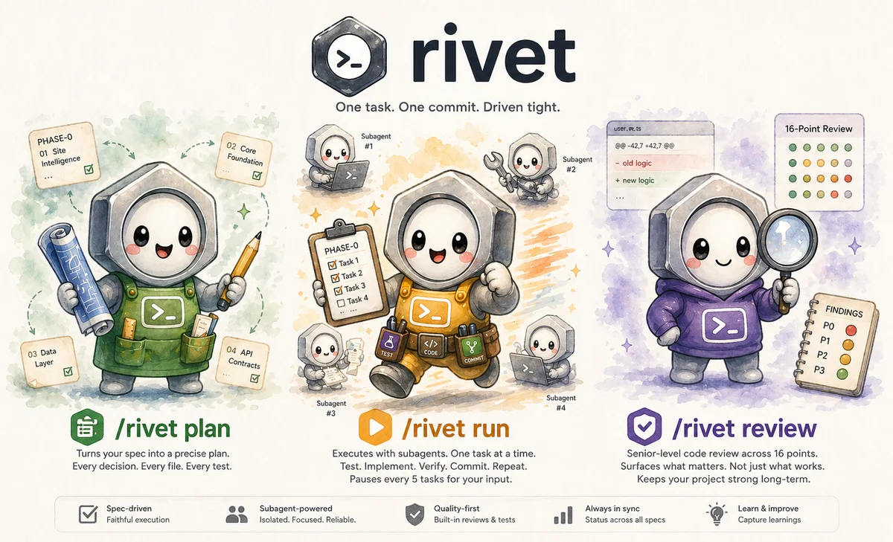

# Rivet — Spec-Driven Development Pipeline for Claude Code

<p align="center">
  
</p>

 

*Where specs get shaped into shipped code.*

A comprehensive guide to `/rivet`: every subcommand, every flag, every natural-language intent, every file it reads or writes, every script, every config knob, plus the workflows you'll actually run day-to-day.

If you want the elevator pitch instead, see [docs/overview.md](docs/overview.md) — supported stacks, FAQ, recommended models, file structure, the short version. If you want the spec for what each subcommand does internally, see [SKILL.md](SKILL.md), [plan.md](plan.md), [run.md](run.md), [review.md](review.md), [status.md](status.md), [learnings.md](learnings.md), [verify.md](verify.md). This document distills all of those into a reader-facing reference.

---

## Table of Contents

- [1. Installation & first-run](#1-installation--first-run)
- [2. Project setup prerequisites](#2-project-setup-prerequisites)
- [3. The mental model](#3-the-mental-model)
- [3.5 Usage at a glance](#35-usage-at-a-glance)
- [4. Subcommand reference](#4-subcommand-reference)
  - [4.1 `/rivet plan`](#41-rivet-plan)
  - [4.2 `/rivet run`](#42-rivet-run)
  - [4.3 `/rivet rollback`](#43-rivet-rollback)
  - [4.4 `/rivet review`](#44-rivet-review)
  - [4.5 `/rivet status`](#45-rivet-status)
  - [4.6 `/rivet learnings`](#46-rivet-learnings)
  - [4.7 `/rivet spec`](#47-rivet-spec)
  - [4.8 `/rivet redesign`](#48-rivet-redesign)
- [5. File layout & conventions](#5-file-layout--conventions)
- [6. Spec discovery rules](#6-spec-discovery-rules)
- [7. Optional: impeccable design integration](#7-optional-impeccable-design-integration)
- [8. The 16 + 1 review points](#8-the-16--1-review-points)
- [9. Helper scripts reference](#9-helper-scripts-reference)
- [10. Configuration](#10-configuration)
- [11. Recommended model usage](#11-recommended-model-usage)
- [12. Permissions and trust model](#12-permissions-and-trust-model)
- [13. Common workflows](#13-common-workflows)
- [14. Common scenarios & troubleshooting](#14-common-scenarios--troubleshooting)
- [15. Glossary](#15-glossary)

---

## 1. Installation & first-run

**Clone + install:**

```bash
git clone git@github.com:latekaapi/rivet.git
cd rivet
bash scripts/install.sh             # interactive y/N if a prior install exists
bash scripts/install.sh --force     # overwrite without prompt (CI / automation)
```

The install copies the skill into `~/.claude/skills/rivet/` (override via `CLAUDE_HOME`, e.g. `CLAUDE_HOME=/opt/claude bash scripts/install.sh`). Restart Claude Code or start a new session to pick the skill up.

**Verify:**

```bash
ls ~/.claude/skills/rivet/   # should list SKILL.md plan.md run.md review.md ... scripts/
```

**Smoke test (optional, ~30s):**

```bash
bash scripts/test-integration.sh   # 10/10 PASS expected; self-contained, no impeccable required
```

**Dev mode (symlink instead of copy):**

```bash
bash scripts/install.sh --link --force   # symlink from ~/.claude/skills/rivet/ to your dev repo
```

Use this if you're working on the skill itself. The skills dir becomes a symlink pointing at your source repo, so any edit you make to `plan.md`, `run.md`, scripts, etc. is immediately live in every Claude Code session — no re-install needed. The `SKILL.md` router lazy-loads subcommand files per-invocation, so the next `/rivet plan` (or whatever) reads your latest content. Edits to `SKILL.md` frontmatter still require a Claude Code restart.

**Uninstall:**

```bash
bash scripts/uninstall.sh           # interactive
bash scripts/uninstall.sh --force   # non-interactive
```

Both honour `$CLAUDE_HOME`. `--help` on either prints the usage block from the script header. `uninstall.sh` works on both copy and symlink installs (a symlink is removed, not followed).

**Windows (PowerShell):**

```powershell
Copy-Item -Recurse -Force . "$env:USERPROFILE\.claude\skills\rivet"
```

---

## 2. Project setup prerequisites

Per project, before running any `/rivet` subcommand:

| Requirement | Why | How |
|---|---|---|
| Git repo | Checkpoint tags + rollback depend on it | `git init` if needed |
| At least one spec | `/rivet plan` reads it | Either `docs/specs/{name}.md` (multi-spec) or a bare `spec.md` at project root (single-spec shorthand) |
| `CLAUDE.md` at project root | Skips re-loading the spec on every `run`; declares test command | Must contain `## Domain Vocabulary` and `## Architecture` sections |
| Test command convention | Stage 0 verification re-runs it per task | Document in CLAUDE.md (e.g., "Test command: `npm test`") |
| `docs/plans/` | Auto-created on first `/rivet plan` | No action needed |

**Optional, only for frontend design-system integration:**

| Requirement | Why |
|---|---|
| `~/.agents/skills/impeccable/` (or `IMPECCABLE_DIR` set) | Provides design-parser.mjs + audit/critique/harden/polish/optimize references |
| `PRODUCT.md` at project root | Defines `register:` (brand vs product voice), optional `## Surfaces` (route → surface → register mapping) |
| `DESIGN.md` (and optionally `DESIGN-{surface}.md`) at project root | Token registry — colors, typography, spacing, rounded |

Without these, design integration silently skips with a one-line note. The plan/run/review/status/learnings core works regardless.

---

## 3. The mental model

`/rivet` thinks in terms of **specs → phases → sub-plans → tasks**.

```
docs/specs/main.md           ← you write this (the spec)
docs/plans/main/             ← /rivet plan writes here
  phase-0/
    01-site-intelligence.md  ← sub-plan with YAML frontmatter listing tasks
    02-prompt-pipeline.md    ← another sub-plan
    learnings-scratch.md     ← in-flight notes during /rivet run
```

Each sub-plan file has a YAML frontmatter listing its tasks (id, title, status, files, depends_on, etc.) plus a `### Task N` markdown block per task with steps, code, expected output. `/rivet run` walks the YAML, dispatches subagents per task, re-verifies tests (Stage 0), reviews quality (Stage 2), checkpoints every N tasks (default: 3, configurable via `checkpointEvery` in `rivet.config.json`).

Ad-hoc work that doesn't belong to any spec uses a parallel layout under `docs/plans/adhoc/`.

The skill is **not** a chat assistant — it's a deterministic pipeline driven by Markdown files plus six commands.

---

## 3.5 Usage at a glance

A quick reference of common invocations. Section 4 has the full per-subcommand reference.

**Spec creation (entry point — produce `docs/specs/{name}.md`):**

```
/rivet spec "founders waste hours on weekly investor updates..."  → draft from a braindump
/rivet spec --from braindump.md                                   → draft from a file
/rivet spec                                                       → synthesize from current conversation
/rivet spec main                                                  → continue an existing spec from its current Status
/rivet spec main --refresh                                        → additive re-validation; decisions stay locked
/rivet spec main --refresh --decision-revisit D2                  → re-open one locked decision
/rivet spec --lite "internal tool for ops team"                   → smaller bet, briefer questions
/rivet spec --from brief.docx --name extension                    → name override + file input
```

Auto-detects attached files in Claude Code / VS Code (drag a file in — no `--from` needed). `--force` bypasses soft quality gates; bypassed gates get recorded in `## Low-Confidence Warnings` at the top of the spec.

**Spec workflow (every spec command takes `{spec} {phase}`):**

```
/rivet plan main phase-0                              → generate micro-step plans from main spec
/rivet plan admin phase-0                             → plans from admin spec
/rivet plan main phase-0 --refresh                    → re-validate existing plan vs current codebase
/rivet plan main phase-0 regenerate sub-plan 2        → rewrite one sub-plan only
/rivet run main phase-0                               → execute via subagents
/rivet run main phase-0 task 3                        → jump to a specific task
/rivet run admin phase-0 expand task 4                → break down a complex task
/rivet run main phase-0 revise task 5 "reason"        → rewrite a task mid-run (plan was wrong)
/rivet run main phase-0 rollback                      → reset to last checkpoint tag (destructive)
/rivet rollback main phase-0 rivet/main/phase-0/ckpt-2  → reset to a specific checkpoint
```

**Single-spec shorthand (when only one spec exists, in `docs/specs/` OR a bare `spec.md` at root):**

```
/rivet plan phase-0                                  → single-spec shorthand
/rivet run phase-0 task 3                            → same inference for run
/rivet status                                        → same scan layout
```

**Ad-hoc workflow (work not in any spec — no spec name):**

```
/rivet plan "add webhook signing verification"     → research + plan from description
/rivet run adhoc/webhook-signing-verification      → execute ad-hoc plan
```

**Anytime:**

```
/rivet status                            → progress across all specs + ad-hoc
/rivet status main                       → drill into just one spec
/rivet review                            → senior code review (16 points + design audit on frontend files)
/rivet learnings                         → end-of-session CLAUDE.md sweep
/rivet redesign                          → re-apply updated DESIGN.md to already-built components
/rivet redesign main phase-0             → scope to one phase
/rivet redesign --dry-run                → preview which components would be touched
```

---

## 4. Subcommand reference

The router is `/rivet [subcommand] [args]`. Calling `/rivet` alone (or with an unrecognized first word) prints help.

| Subcommand | Recommended model | Purpose |
|---|---|---|
| `spec` | Opus family | Produce a strategic execution document from a braindump (Validation → Architecture → Synthesis) |
| `plan` | Opus family | Generate micro-step plans from a spec phase or ad-hoc task |
| `run` | Sonnet family | Execute plans via subagents with review + checkpoints |
| `rollback` | Sonnet family | Reset to a checkpoint tag (destructive; confirms first) |
| `review` | Sonnet family | Senior code review (16 points + design audit if applicable) |
| `status` | Sonnet family | Progress dashboard across all specs + ad-hoc |
| `learnings` | Sonnet family | End-of-session CLAUDE.md / README.md sweep |
| `redesign` | Sonnet family | Re-apply an updated DESIGN.md to already-built components (visual pass only) |

### 4.1 `/rivet plan`

**Purpose.** Read a spec phase (or take an ad-hoc task description), gather context via parallel research agents, propose a 4–8-hour-sized split into sub-plans, then generate micro-step task files with YAML frontmatter. Each task follows TDD: write failing test → verify fail → implement → verify pass → commit. Every sub-plan ends with an integration test.

**Argument shapes:**

| Form | Example | What it does |
|---|---|---|
| `{spec} {phase}` | `/rivet plan main phase-0` | Plan from `docs/specs/main.md` Phase 0 |
| `{phase}` (single-spec) | `/rivet plan phase-0` | Single-spec shorthand — only one spec discovered |
| `{spec} {phase} --refresh` | `/rivet plan main phase-0 --refresh` | Re-validate an existing plan vs current codebase; recompute design hashes; re-enrich non-done UI tasks |
| `{spec} {phase} regenerate sub-plan N` | `/rivet plan main phase-0 regenerate sub-plan 2` | Rewrite one sub-plan file; preserves `origin: audit` tasks |
| `"free text"` (ad-hoc) | `/rivet plan "add webhook signing verification"` | Plans land at `docs/plans/adhoc/webhook-signing-verification.md` after web + docs + codebase research |

**Pre-flight (when impeccable + PRODUCT.md + DESIGN.md exist):**
- Validates DESIGN.md frontmatter via [scripts/design-lint.mjs](scripts/design-lint.mjs) `--validate-spec`. Stops if broken.
- Generates a per-phase component catalog (`docs/plans/{spec}/{phase}/component-catalog.md`) grouped by surface.
- Writes a canonical per-surface design brief to `docs/design/brief-{surface}.md` (shared across every spec).

**Per-task fields the planner emits:**
- `id`, `title`, `status: pending`, `estimated_min`, `files: [...]`, `depends_on: [...]`
- For UI tasks: `ui: true`, `surface: {name}`, `register: brand|product`, `reuse: [...]`, `new_primitive: {name, path, reason, ...}`, `ui_commands: [...]`, `design_extends:` (optional)

**Cross-spec collision detection.** When the spec touches code referenced by another spec's planned phase, `/rivet plan` flags the collision before generating tasks (lists which spec + phase + table/file/component, asks who owns it).

**Outputs:**
- `docs/plans/{spec}/{phase}/{nn}-{sub-plan-name}.md` (one file per sub-plan)
- `docs/plans/{spec}/{phase}/component-catalog.md` (when frontend roots exist)
- `docs/design/brief-{surface}.md` (canonical, project-wide)
- Optional `docs/plans/{spec}/{phase}/design-brief-{surface}.md` (per-phase override)

**Ad-hoc plan output:** `docs/plans/adhoc/{name}.md` (single file) or `docs/plans/adhoc/{name}/{nn}-{sub}.md` (directory if the work is large enough to split).

### 4.2 `/rivet run`

**Purpose.** Execute the plan via subagent dispatch with three-stage review per task, checkpoints every N tasks (default: 3), optional design verification at the end of each sub-plan. Resumes intelligently — re-running just `/rivet run main phase-0` continues from the next incomplete task.

**Argument shapes:**

| Form | Example | What it does |
|---|---|---|
| `{spec} {phase}` | `/rivet run main phase-0` | Resume from next pending task |
| `{phase}` (single-spec) | `/rivet run phase-0` | Single-spec shorthand |
| `adhoc/{name}` | `/rivet run adhoc/webhook-signing` | Execute an ad-hoc plan |
| `{spec} {phase} task N` | `/rivet run main phase-0 task 3` | Jump to a specific task |
| `{spec} {phase} just task N` | `/rivet run main phase-0 just task 3` | Run only that task, do not continue |
| `{spec} {phase} start from task N` | `/rivet run main phase-0 start from task 5` | Same as `task N` (NL alias) |
| `{spec} {phase} expand task N` | `/rivet run admin phase-0 expand task 4` | Break down a complex task; rewrite plan; ask for confirmation |
| `{spec} {phase} revise task N "reason"` | `/rivet run main phase-0 revise task 5 "API returns null"` | Rewrite task N (and downstream if dependencies change) |
| `{spec} {phase} rollback` | `/rivet run main phase-0 rollback` | Reset to last checkpoint (shortcut for `/rivet rollback`) |
| `--skip-verify` (any position) | `/rivet run main phase-0 --skip-verify` | Skip end-of-sub-plan design audit. Per-task Stage 2a still runs. |

The argument parser is intentionally NL-tolerant. Phrases like `start from task 5`, `skip to task 7`, `only task 3` all work.

**Pre-flight checks (Step 0):**
1. **Working tree clean?** `git status --porcelain` must be empty. Offers commit / stash / abort otherwise.
2. **Branch up to date with remote?** `git fetch` + `git status -uno`. Offers `git pull --ff-only` or proceed.
3. **Dependencies fresh?** Diff lockfiles between `HEAD` and `HEAD~1` (`composer|package|yarn|bun .lock|.lockb`). If changed, prompt to install.
4. **On main/master?** Offer to create and switch to `rivet/{spec}/{phase}` (or `rivet/adhoc/{name}`).
5. **Design context drift?** If the plan has `design_hashes`, recompute and warn if any surface's hash changed.

**Per-task subagent dispatch.** Each subagent gets ONLY:
- The specific task (steps, code, paths, commands, expected output)
- The verification checklist (in [verify.md](verify.md))
- Relevant CLAUDE.md excerpts

Each subagent does NOT get the full plan, the spec, prior task results, or conversation history. Context isolation is intentional.

**Three-stage review per task:**

| Stage | What | If it fails |
|---|---|---|
| 0 — Test verification (mandatory) | Coordinator re-runs the exact test command from the task and compares to `Expected: PASS` | Dispatch a fix subagent; do NOT trust the subagent's report; counts as a failure for the bail-out heuristic |
| 1 — Spec compliance | Did the subagent do exactly what the task asked? Touch only listed files? Use spec vocabulary? Tests pass? | Fix or re-dispatch |
| 2 — Per-task quality | Apply review points 4 (correctness/edges), 6 (duplication/dead code), 10 (domain language), 16 (naming) from [review.md](review.md) | Fix or re-dispatch |
| 2a — Design enforcement (UI tasks only) | Token lint + `design_extends` apply + reuse declaration match + catalog duplicate check | Hard-fail; revise subagent dispatched with violation report |

**Stage 2a sub-checks (UI tasks):**
1. **`design_extends` application.** If task declares new tokens, merge into surface DESIGN file and update plan's `design_hashes`.
2. **Design Token Lint.** Runs `node design-lint.mjs --design <ref> --files <changed>`. Hard-fails on hardcoded hex outside the registry, off-scale px/rem, unknown fonts.
3. **Reuse / new_primitive declaration match.** Two checks: (a) every created file matches a `new_primitive.path` or is declared via `reuse:`; (b) every declared `reuse:` entry is actually imported via `check-reuse.mjs`.
4. **Component catalog duplicate-similarity check.** Trigram similarity via `similarity.mjs`. Bands: ≥0.80 auto-flag (reject + offer A/B/C menu), 0.35–0.80 gray-zone (single LLM tiebreaker), ≤0.35 auto-pass.

**Parallel dispatch.** Up to 3 tasks in parallel when all of: `status: pending` + all `depends_on:` are `done` + no overlap in `files:`. Parallel subagents stage but DO NOT commit (avoids `.git/index.lock` collisions); coordinator commits sequentially in task-id order after each clears review.

**Bail-out heuristic.** After 3 consecutive task failures (each requiring a fix-and-retry), halt and present three options:
1. `/rivet run {spec} {phase} revise task {c} "..."`
2. `/rivet plan {spec} {phase} --refresh`
3. Continue anyway

**Checkpointing.** Every N completed tasks (default: 3, set `checkpointEvery` in `rivet.config.json`), run the **full test suite** (regression catch). On pass, tag the tree:
```bash
git tag rivet/{spec}/{phase}/ckpt-{n}    # spec mode
git tag rivet/adhoc/{name}/ckpt-{n}      # ad-hoc mode
```
Then prompt: `Continue? (y / pause / review)`.

**Sub-Plan Design Verification (requires impeccable).** After all tasks complete and tests pass, dispatches per-surface in parallel:
- **Audit** subagent → `${IMPECCABLE_DIR}/reference/audit.md` → P0–P3 technical findings (a11y, perf, theming, responsive, anti-patterns)
- **Critique** subagent → `reference/critique.md` → UX heuristic + persona scoring
- **Harden** subagent → `reference/harden.md` → edge-case findings (i18n, overflow, long text, big data, errors)
- **Polish** subagent → `reference/polish.md` (ONLY if zero P0/P1 across the merged result)
- **Optimize** subagent → `reference/optimize.md` (ONLY if any task touched lists/tables/charts/animation/heavy imports)

P0/P1 findings on accept become new tasks with `origin: audit`. P2/P3 are presented as suggestions only.

Skip the entire verification block via `--skip-verify`, no `ui: true` tasks, missing PRODUCT.md/DESIGN.md, or missing impeccable.

**Sub-Plan Transitions menu (always shown after a sub-plan finishes):**
1. Continue to next sub-plan
2. Squash commits (one commit per sub-plan, cleaner history)
3. Pause
4. Review (run `/rivet review` on the sub-plan's changes)

**Learnings scratch file.** During execution, the coordinator appends one-liners to `docs/plans/{spec}/{phase}/learnings-scratch.md` for:
- `[correction]` — user pushed back on the approach
- `[discovery]` — subagent found something surprising (API quirk, env requirement)
- `[decision]` — coordinator made a judgment call

`/rivet learnings` consumes and clears this file at end of session.

### 4.3 `/rivet rollback`

**Purpose.** Destructive. Reset to a checkpoint tag, then revert task statuses for any task whose commits got reset.

**Argument shapes:**

| Form | Example | Behaviour |
|---|---|---|
| `{spec} {phase}` | `/rivet rollback main phase-0` | Roll back to most recent checkpoint for that phase |
| `{spec} {phase} {tag}` | `/rivet rollback main phase-0 rivet/main/phase-0/ckpt-2` | Roll back to specific tag |
| `adhoc/{name}` | `/rivet rollback adhoc/webhook-signing` | Most recent ad-hoc checkpoint |
| `adhoc/{name} {tag}` | `/rivet rollback adhoc/webhook-signing rivet/adhoc/webhook-signing/ckpt-1` | Specific ad-hoc tag |

**Flow:**
1. List most recent 5 checkpoint tags (with commit date + subject)
2. Show what will be lost: `git log --oneline {target}..HEAD`
3. Ask for explicit confirmation: `This will reset X commits. Proceed? (y/n)`
4. On `y`: `git reset --hard {target}`
5. Walk the plan's YAML frontmatter; for any task whose most recent commit (matching task id in subject) is newer than `{target}`, reset `status:` to `pending`

**No checkpoints exist?** Tells you so and points at `git log --oneline` for manual recovery — no destructive default.

### 4.4 `/rivet review`

**Purpose.** Senior code review — 16 fixed points + Point 17 (Design System Compliance) when triggered. Produces a P0–P3 report with verdict APPROVE / REQUEST CHANGES / COMMENT, then offers granular fix options.

**Argument shapes:**

| Form | Example | Scope |
|---|---|---|
| (no args) | `/rivet review` | Files changed since last `review-*` git tag, or since last review marker, or `git diff main --name-only` |
| `<file paths>` | `/rivet review src/components/Button.tsx src/lib/api.ts` | Only those files |
| `<branch>` | `/rivet review feature/x` | All changes on that branch vs main |
| `--full` | `/rivet review --full` | Entire codebase (slow — warned) |
| PR number | `/rivet review pr 42` (also accepts `pr-42`, `#42`, `--pr 42`) | The PR diff fetched via `gh pr diff 42`; metadata fetched via `gh pr view 42`. Requires `gh` installed and authenticated. |

**What it reads (Step 2 — load context):**
- `CLAUDE.md`
- Every spec in the repo (multi-spec drift detection)

**What it reads (Step 3 — gather code):**
- The diff
- Each changed file in full (not just diff hunks)
- Immediate dependents (files that import or are imported by the changed files)

**Severity gates:**

| Level | Verdict implication |
|---|---|
| P0 — Critical (security, data loss, correctness bug) | REQUEST CHANGES |
| P1 — High (logic error, contract violation, missing error handling) | REQUEST CHANGES |
| P2 — Medium (smell, coupling, missing test, removal candidate) | COMMENT |
| P3 — Low (naming, minor refactor, style) | COMMENT (or APPROVE if only P3) |
| Nothing found | APPROVE |

**Point 17 trigger** (all three must hold):
- Scope contains `.tsx`, `.jsx`, `.vue`, `.svelte`, `.astro`, or `.blade.php`
- Both `PRODUCT.md` and `DESIGN.md` exist at project root
- Impeccable installed at `${IMPECCABLE_DIR:-~/.agents/skills/impeccable}/`

If trigger doesn't fire, point 17 is reported as `N/A ({reason})` in the "Passed Clean" section.

**Where the report lands.** Every `/rivet review` run saves its report under `reviews/`, stratified by detected lineage so multi-spec repos don't pile every review into a flat directory. Lineage is detected from the reviewed branch: if it matches `rivet/{spec}/{phase}` (and that spec/phase exists), the report goes under `reviews/{spec}/{phase}/`. Otherwise it lands in a sibling subdirectory keyed by scope shape. Reviews are durable artifacts: linkable, diffable, and re-readable across sessions.

| Scope + lineage | Path pattern | Example |
|---|---|---|
| `pr` on `rivet/{spec}/{phase}` branch | `reviews/{spec}/{phase}/pr-{n}-{kebab(title, ≤50)}.md` | `reviews/main/phase-2/pr-42-fix-webhook-signing.md` |
| `pr` on `rivet/adhoc/{name}` branch | `reviews/adhoc/{name}/pr-{n}-{kebab(title)}.md` | `reviews/adhoc/webhook-signing/pr-42-...md` |
| `pr` on a non-rivet branch | `reviews/branch/pr-{n}-{kebab(title)}.md` | `reviews/branch/pr-99-third-party-pr.md` |
| `branch` (any) | `reviews/{lineage-dir or "branch"}/branch-{kebab(branch)}-{YYYY-MM-DD}.md` | `reviews/main/phase-2/branch-rivet-main-phase-2-2026-04-27.md` |
| `files` | `reviews/files/files-{YYYY-MM-DD}-{kebab(first-file-stem)}.md` | `reviews/files/files-2026-04-27-button.md` |
| `--full` | `reviews/full/full-{YYYY-MM-DD}.md` | `reviews/full/full-2026-04-27.md` |
| (no args) | `reviews/{lineage-dir or "default"}/changes-{YYYY-MM-DD}-{kebab(branch)}.md` | `reviews/default/changes-2026-04-27-main.md` |

Each saved file starts with a small YAML frontmatter block (scope, PR/branch/files metadata, date, verdict, finding counts by severity, plus `lineage_kind` / `lineage_spec` / `lineage_phase` / `lineage_adhoc` for downstream tooling), followed by the full report markdown verbatim. **Collisions never overwrite** — re-running against the same PR appends `-2`, `-3`, … before `.md`, so the prior review stays intact.

Existing flat `reviews/*.md` files from before stratification keep working. Both layouts are accepted as `/rivet plan --from-review` inputs.

`reviews/` is meant to be committed by default — the directory accrues a history of what was reviewed and when, and is useful for spotting trends (e.g. recurring P1 categories). If you'd rather not commit them, add `reviews/` to `.gitignore`.

**After the report, you choose** (Step 7 chains into the plan/run pipeline — the old inline "fix and commit" loop is gone):
1. Fix all → generates `/rivet plan --from-review <path>` then offers to start `/rivet run`
2. Fix P0/P1 only → same plan/run flow, with `--max-priority p1`
3. Fix specific items → prompts for finding numbers, then `--items <list>` plan/run flow
4. No changes (review complete)

**Generated fix-plan layout.** When lineage is detected, the fix-plan nests under the parent phase: `docs/plans/{spec}/{phase}/reviews/{slug}/{nn}-{bucket}.md` (one sub-plan per priority bucket — `01-p0`, `02-p1`, `03-p2`, `04-p3`; empty buckets skipped, output renumbered contiguously). Run target: `/rivet run {spec} {phase} review {slug}`. Branch: `rivet/{spec}/{phase}/reviews/{slug}`. Checkpoint tags: `rivet/{spec}/{phase}/reviews/{slug}/ckpt-{n}`. When no lineage is detectable (full / files / non-rivet branch), the fix-plan lives at `docs/plans/adhoc/review-{slug}/`, runs as `/rivet run adhoc/review-{slug}`, and is shown under the Ad-hoc section in `/rivet status` with a `(review)` label.

### 4.5 `/rivet status`

**Purpose.** Read-only progress dashboard. Reads YAML frontmatter across plan files, computes actual hours from git commit timestamps, flags stale plans.

**Argument shapes:**

| Form | Example | Output |
|---|---|---|
| (no args) | `/rivet status` | All specs + ad-hoc, summary view |
| `{spec}` | `/rivet status main` | Drill into one spec: phases + task-level detail + recent session-log entries |
| `{spec} {phase}` | `/rivet status main phase-0` | Most detail: per-task status, remaining task names |
| `{phase}` (single-spec) | `/rivet status phase-0` | Same when only one spec exists |

**Stale detection:**
- Plan with incomplete tasks but session log idle >7 days → "⚠ X has been idle for N days"
- Task marked `done` but no matching commit in git → "⚠ progress may be inaccurate"
- Task stuck in `in_progress` >24 hours → "⚠ a prior run likely crashed; resume or revert"

**Sample output:**

```
Rivet Progress
══════════════

main
  Phase 0 — Manual Validation
    01-site-intelligence.md     ████████████████████░  18/22 tasks  est 8h, actual 5h
    02-prompt-pipeline.md       ████████░░░░░░░░░░░░   8/20 tasks   est 8h, actual 3h
    Phase total: 26/42 tasks

Ad-hoc
  webhook-signing.md            ████████████████████   ✓ 6/6 tasks  est 2h, actual 3h

──────────
Overall: 32/48 tasks across 1 spec + 1 ad-hoc

Next action: /rivet run main phase-0
  → Resuming 02-prompt-pipeline.md at Task 9
```

### 4.6 `/rivet learnings`

**Purpose.** End-of-session knowledge sweep. Reads `learnings-scratch.md` files (in-flight captures during execution), applies a high bar, proposes (does NOT apply) edits to CLAUDE.md / README.md, flags spec contradictions.

**No arguments.**

**The bar.** A candidate learning is worth codifying ONLY if it meets at least one of:
1. Non-obvious gotcha (cost real time)
2. Convention the code doesn't self-document
3. User correction that's reusable beyond this task
4. External dependency / env requirement (fresh-clone breaker)
5. Architectural decision with a non-obvious reason

Rejected: session summaries, restating obvious code, generic best practices, one-off debugging fixes, anything already in CLAUDE.md / README.md.

**Cleanup.** After the user reviews findings (apply or reject), `/rivet learnings` deletes every scratch file walked. Stale scratch content re-proposes itself otherwise.

**"Nothing worth codifying"** is a valid and often-correct outcome. It's not failure — it's an honest answer.

### 4.7 `/rivet spec`

**Purpose.** Produce a strategic execution document at `docs/specs/{name}.md` that `/rivet plan` then consumes. Takes a braindump, an attached file, an existing draft, or just the current conversation, and runs three internal phases — **Validation → Architecture → Synthesis** — tracked by a `Status:` field at the top of the spec (`Validating | Validated | Architecting | Drafting | Complete | Killed | Pivoted`). Earlier phases stay visible in the final document; the spec is a record of what was thought through, not just a build plan.

**Argument shapes:**

| Form | Example | What it does |
|---|---|---|
| `<braindump>` | `/rivet spec "founders waste hours writing weekly investor updates..."` | Inline text. Default `--deep`, default name `main`. |
| `--from <file>` | `/rivet spec --from braindump.md` | Explicit file input. Path-detection of attached files still runs. |
| (no args) | `/rivet spec` | Synthesizes from the current conversation. Skips the clarification interview. |
| `{name}` | `/rivet spec main` | Looks for `docs/specs/main.md`. If exists → continues from current `Status:`. If not → treats `main` as the name override and proceeds with intake. |
| `{name} --refresh` | `/rivet spec main --refresh` | Additive re-validation. Decisions stay locked; assumptions and research get walked. |
| `{name} --refresh --decision-revisit D2` | — | Re-opens one specific Decision Made; siblings stay locked. |
| `--lite` / `--deep` | `/rivet spec --lite "internal team tool"` | Bet size; both have full rigor, `--lite` asks fewer questions. |
| `--force` | — | Bypass quality gates. Bypassed gates are recorded in the spec's `## Low-Confidence Warnings` section. |
| `--name <n>` | `/rivet spec --from draft.md --name extension` | Override default name. |

**File attachment behavior in Claude Code.** Step 1.1 of [spec.md](spec.md) auto-detects attached files in client (path tokens, markdown links, `@file` references, attachment markers, "see the file" phrasing). Drag a file in and `/rivet spec` reads it without `--from`.

**Three internal phases:**

1. **Validation.** Quality gate (4 soft criteria) → clarification interview (one question at a time, 4–8 deep / 2–3 lite) → bet framing (six-clause template) → four-register extraction (Known Facts, Stated Assumptions, Open Questions, Risks) → bounded competitive scout via parallel subagents → kill criteria with dates → bet sizing + reversibility → adversarial pass producing an Opposition Register → recommendation (Proceed / Validate first / Pivot / Kill).
2. **Architecture.** Always 2–3 alternatives per major decision → bounded research per component → architecture decisions logged with alternatives + trigger-to-revisit → capabilities decomposition (capabilities are primary; phases are derived) → pricing strategy → go-to-market → operating model → non-goals (≥3 with reasoning).
3. **Synthesis.** Phase projection (capabilities → `## Phase N` headings that `/rivet plan` consumes) → cross-spec dependency surfacing → traceability links (anchor-linked from phase to capability to register entry) → Mermaid diagrams → hygiene self-review subagent → quality scoring against the 12-dimension rubric in [references/quality-rubric.md](references/quality-rubric.md).

**Soft quality gates.** Missed criteria become warnings, not hard fails. The user can `--force` past them; bypassed gates are recorded in `## Low-Confidence Warnings` near the top of the spec, so the next reader (or `--refresh`) sees the gaps.

**Multi-spec capable.** Step 1.3 scans for independent subsystems (different audience / deployment surface / release cadence / revenue logic). When detected, proposes decomposition (e.g., `extension.md` + `backend.md`); default is one spec, splitting is opt-in. Cross-spec dependencies are surfaced in Synthesis phase 4.2.

**Refresh is additive.** `/rivet spec {name} --refresh` walks the registers (assumptions become Facts or Risks based on user input), re-fetches stale research (>4 weeks old), checks past-dated kill criteria for triggers, and recomputes the quality score. The Decision Log stays locked unless `--decision-revisit D{n}` re-opens a specific entry. To rewrite a spec from scratch, delete the spec file and start fresh.

**Outputs:**
- `docs/specs/{name}.md` — the spec itself (all three phases visible).
- `docs/specs/{name}-research.md` — raw research findings with citations + provenance, linked from the main spec by section anchor.

**When deep vs. lite:**
- `--deep` (default) — bigger bets, longer runway, more rigor on opposition register and bet sizing. ≥3 kill criteria. ~4–8 clarification questions.
- `--lite` — smaller bets (internal tools, weekend experiments, well-scoped extensions to existing products). ≥1 kill criterion. ~2–3 clarification questions. Same register format; fewer entries expected.

**Pre-flight checks (Step 0):**
1. **Working tree clean?** Warn if dirty (spec writes are low-risk; offer abort).
2. **Existing spec at the target name?** Read its `Status:` and offer continue / refresh / overwrite / abort.
3. **Project context.** Read `CLAUDE.md`, `PRODUCT.md` if present (especially the authors field for Step 2.9 co-founder alignment).

**Recommended model.** Opus family. `/rivet spec` is a thinking task — adversarial pass, four-register classification, decision-tradeoff analysis, capability decomposition. Cheaper models produce specs that look right syntactically but miss the reasoning that separates a useful spec from a checked-the-box spec. Cost is small relative to the multi-week build the spec authorizes.

**Reference docs** (linked from inside [spec.md](spec.md)):
- [references/assumption-register-format.md](references/assumption-register-format.md) — the F/A/O/R pattern, transition rules.
- [references/decision-log-format.md](references/decision-log-format.md) — Decisions Made + Decisions Deferred templates.
- [references/question-frameworks.md](references/question-frameworks.md) — clarification banks, priority order.
- [references/research-playbook.md](references/research-playbook.md) — bounded subagent dispatch, per-area budgets.
- [references/decision-categories.md](references/decision-categories.md) — stack / data / pricing / GTM / architecture / moat tradeoffs.
- [references/quality-rubric.md](references/quality-rubric.md) — 12-dimension scoring with pass thresholds.

**Worked example.** A structural placeholder lives at [examples/headturn-spec.md](examples/headturn-spec.md). It mirrors the canonical output shape from [spec.md](spec.md) Step 5 with a "Worked snippets" appendix at the bottom showing concrete F-entry, D-entry, capability, and kill-criteria formats.

**Next: `/rivet plan`.** Once the spec reaches `Status: Complete`:

```
/rivet plan {name} phase-0
```

`/rivet plan` reads the spec's `## Phase N` headings, picks the requested one, and generates sub-plans against it. Capability IDs and decision-log entries carry through.

### 4.8 `/rivet redesign`

**Purpose.** When DESIGN.md is updated — via `$impeccable document`, `$impeccable teach`, Google Stitch, or a manual token edit — already-built components go stale. `/rivet redesign` closes the loop: it scans plan files for surfaces whose stored `design_hashes[surface].ref_sha` no longer matches the current DESIGN.md, then dispatches targeted subagents to re-apply `ui_commands` (typeset, colorize, layout, animate, etc.) to the affected component files. It is a **visual pass only** — no TDD cycle, no logic or prop changes, no test modifications.

**Argument shapes:**

| Form | Example | What it does |
|---|---|---|
| (no args) | `/rivet redesign` | Scan all plans across all specs/phases for DESIGN.md drift |
| `{spec} {phase}` | `/rivet redesign main phase-0` | Scope to one phase only |
| `{phase}` (single-spec) | `/rivet redesign phase-0` | Single-spec shorthand |
| `--surface {name}` | `/rivet redesign main phase-0 --surface marketing` | Re-apply one surface only |
| `--tasks {n,m,p}` | `/rivet redesign main phase-0 --tasks 3,7` | Re-apply specific task IDs only |
| `--dry-run` (any position) | `/rivet redesign --dry-run` | Show what would be re-applied without touching any files |

**When to use it:** Any time you run `$impeccable document` or `$impeccable teach` to update DESIGN.md, or edit a color/spacing/typography token directly. After finishing, `/rivet run` pre-flight will no longer warn about design drift for the updated surfaces.

**What it does, step by step:**

1. **Gate check.** Verify DESIGN.md exists and impeccable is installed. Require a clean working tree (redesign commits must be isolated).
2. **Scan.** Walk sub-plan files in scope. For each surface in `design_hashes`, compare `sha256(DESIGN.md)` to the stored `ref_sha`. Collect every `ui: true` task on stale surfaces.
3. **Report.** Show a summary table (surface → sub-plans → task count → file count → SHA diff). Exit here on `--dry-run`.
4. **Refresh briefs.** For each stale surface, regenerate `docs/design/brief-{surface}.md` from the updated DESIGN.md + PRODUCT.md + impeccable references (once per surface, not per task). Warns before overwriting hand-edited briefs.
5. **Dispatch subagents.** For each affected UI task, dispatches a subagent with the existing component files, the updated design brief, and the task's original `ui_commands`. Same parallel rules as `/rivet run` (up to 3 concurrent, no file-path overlap). Subagents stage but do not commit.
6. **Lint.** Runs `design-lint.mjs` after each subagent. On violations, dispatches a fix subagent (cap 2 retries). Persistent failures are marked `redesign_failed` — stale hashes remain for those tasks.
7. **Commit.** Coordinator commits per task: `design: apply {surface} redesign to {task.title} ({sub-plan} task {id})`.
8. **Update hashes.** Writes new `ref_sha` and `canonical_sha` into plan frontmatter for every fully-passing sub-plan. Commits all frontmatter updates per phase: `design: update design_hashes after {surface} redesign — {spec}/{phase}`.

**What it does NOT do** (intentional):
- No TDD cycle — tests are not re-run, test files are never modified.
- No Component Catalog duplicate check — re-applying to existing components, not creating new ones.
- No Sub-Plan Design Verification (audit/critique/harden) — that pass is for newly-built components.
- No checkpoint tags.

**If some tasks fail** (`redesign_failed`), their hashes stay stale. Fix the components manually, then re-run `/rivet redesign` — it will pick up only the still-stale tasks.

**Recommended model:** Sonnet family. This is an execution pass (like `/rivet run`), not a planning pass.

---

## 5. File layout & conventions

Inside the skill install (`~/.claude/skills/rivet/`):

```
SKILL.md          Router (lazy-loads subcommand files)
plan.md           Plan generator
run.md            Executor (Stage 0/1/2/2a, checkpoints, rollback, parallel dispatch)
review.md         16-point + optional Point 17 reviewer
status.md         Progress dashboard
learnings.md      Knowledge capture
verify.md         Subagent verification protocol
README.md         This comprehensive guide (top of repo)
docs/
  overview.md                Elevator pitch, supported stacks, FAQ, file structure (brief version)
  verification-scenarios.md  24 manual end-to-end test scenarios
  assets/                    Static assets (hero image, future visuals)
CHANGELOG.md      Release history
CONTRIBUTING.md   Contributor guide
LICENSE           MIT
scripts/
  install.sh              Install / overwrite
  uninstall.sh            Removal
  test-integration.sh     ~30s smoke test (10 steps, self-contained)
  design-lint.mjs         DESIGN.md validator + token linter (Stage 2a gate)
  catalog-components.mjs  Frontend component scanner per surface
  check-reuse.mjs         Import-aware reuse declaration verifier
  similarity.mjs          Trigram similarity for catalog duplicate check
  test-fixtures/
    impeccable/scripts/design-parser.mjs    Vendored stub for self-contained smoke test
```

In your project (each item is created the first time it's needed):

```
docs/
  specs/
    main.md                                     One file per spec
    admin.md
  plans/
    main/
      phase-0/
        01-site-intelligence.md                 YAML frontmatter + ### Task N blocks
        02-prompt-pipeline.md
        component-catalog.md                    Written by /rivet plan when frontend roots exist
        learnings-scratch.md                    Written during /rivet run
        design-brief-{surface}.md               Optional per-phase override
    admin/
      phase-0/
        01-admin-scaffold.md
    adhoc/
      webhook-signing.md                        Single file
      payment-redesign/                         Or directory with multiple sub-plans
        01-checkout.md
        02-confirmation.md
  design/
    brief-marketing.md                          Canonical, project-wide
    brief-dashboard.md
CLAUDE.md                                       MUST have ## Domain Vocabulary + ## Architecture
PRODUCT.md                                      Optional, for impeccable integration
DESIGN.md                                       Optional, for impeccable integration
DESIGN-{surface}.md                             Optional surface-specific token override
rivet.config.json                               Optional, for componentRoots override
spec.md                                         Optional, single-spec fallback at project root
```

**Branch convention:** `rivet/{spec}/{phase-id}` for spec phases, `rivet/adhoc/{name}` for ad-hoc work. The pre-flight check offers to create the branch when you're on `main` / `master`.

**Checkpoint tags:** `rivet/{spec}/{phase-id}/ckpt-{n}` (or `rivet/adhoc/{name}/ckpt-{n}`). One per checkpoint (every N completed tasks, default: 3). Rollback targets.

---

## 6. Spec discovery rules

`/rivet` discovers specs identically across `plan`, `run`, `review`, `status`, `learnings`. The rules:

1. List `docs/specs/*.md`. Every match is a spec; the basename (without `.md`) is the spec name.
2. If `docs/specs/` is missing or empty, look for a bare `spec.md` at the project root. If present, treat it as a single spec named `spec` (literal).
3. If both are empty, only ad-hoc mode works.

**Single-spec shorthand.** When exactly one spec is discovered (either source), you may omit the spec name on every command:

```bash
/rivet plan phase-0          # equivalent to: /rivet plan {only-spec} phase-0
/rivet run phase-0 task 3    # equivalent to: /rivet run {only-spec} phase-0 task 3
/rivet status                # scans across the lone spec
```

With multiple specs, the spec name is required. An unrecognized first arg that looks like a phase prompts: "Which spec did you mean? Available: main, admin, agency."

---

## 7. Optional: impeccable design integration

Skip this section if you don't need design-system enforcement. The plan/run/review/status/learnings core works stand-alone.

### 7.1 Setup (per project)

```bash
$impeccable teach          # Writes PRODUCT.md with register: + optional ## Surfaces
$impeccable document       # OR Google Stitch — writes DESIGN.md
```

### 7.2 PRODUCT.md schema

```yaml
---
register: brand            # or 'product'
---

## Surfaces                # optional
- name: marketing
  route: marketing/**
  register: brand
  design_ref: DESIGN.md

- name: dashboard
  route: app/dashboard/**
  register: product
  design_ref: DESIGN.md

- name: admin
  route: admin/**
  register: product
  voice_overlay: utilitarian
  design_ref: DESIGN-admin.md
```

If no `## Surfaces` section, every UI task gets `surface: default`.

### 7.3 DESIGN.md schema (frontmatter the script needs)

```yaml
---
name: ...
colors:
  primary: "#hex"
  ...
typography:
  body:
    fontFamily: "..."
    fontSize: "16px"
spacing:
  sm: "8px"
  md: "16px"
rounded:
  sm: "4px"
---

## Overview
...
## Colors
...
## Typography
...
## Elevation
...
## Components
...
## Do's and Don'ts
...
```

`design-lint.mjs --validate-spec` checks that all sections exist and frontmatter has at least one color + one typography role.

### 7.4 What plan / run / review do with it

| Subcommand | Behaviour with impeccable |
|---|---|
| `/rivet plan` | Validates DESIGN.md → generates component catalog → writes per-surface canonical brief at `docs/design/brief-{surface}.md` → embeds Design Spec + Design Verification per UI task |
| `/rivet run` Step 0 | Warns if DESIGN.md drifted since plan was generated (hash check) |
| `/rivet run` Stage 2a | Mechanical chain per UI task: design_extends apply → token lint → reuse declaration match → catalog duplicate check |
| `/rivet run` Sub-plan verification | Parallel audit + critique + harden subagents per surface; polish gated on zero P0/P1; optimize gated on heavy-import / list / chart / animation triggers |
| `/rivet review` Point 17 | Mechanical lint + audit + critique on changed frontend files |
| `/rivet redesign` | Re-applies the visual layer to already-built components after DESIGN.md changes; updates `design_hashes` in plan frontmatter on completion |

### 7.5 Brief resolution chain (for review and verification)

```
1. docs/design/brief-{surface}.md                              ← canonical (preferred)
2. + docs/plans/{spec}/{phase}/design-brief-{surface}.md       ← per-phase override (composed on top)
3. (no canonical) docs/plans/{spec}/{phase}/design-brief-{surface}.md  ← phase-only
4. (none of the above) derive on the fly from PRODUCT.md + DESIGN.md   ← noted in report as "Brief source: derived"
```

### 7.6 Non-default impeccable install path

The fallback is `~/.agents/skills/impeccable/`. If you put it elsewhere (e.g., `~/.claude/skills/impeccable/` to keep it next to other Claude skills), set `IMPECCABLE_DIR` in your shell profile:

```bash
export IMPECCABLE_DIR=~/.claude/skills/impeccable
```

Without this, anywhere other than the default won't be discovered.

---

## 8. The 16 + 1 review points

Every `/rivet review` walks points 1–16 in order. Point 17 runs only when its trigger fires.

| # | Name | What it checks |
|---|---|---|
| 1 | API Integration Resilience | Timeouts, retryable vs permanent error distinction, graceful degradation, no expensive calls in loops, response-shape validation |
| 2 | Job & Queue Safety | Idempotency, partial-failure consistency, transaction boundaries, queue routing, retry caps |
| 3 | Data Integrity | Safe nested-key access, constraint↔assumption alignment, migration safety, enum consistency, no orphaned records |
| 4 | Correctness & Edge Cases | Nulls, empty arrays, zero-length strings, malformed URLs, unexpected response shapes, off-by-ones, race conditions |
| 5 | Architecture & Extractability | Service-class patterns, dependency direction, single responsibility, framework-coupling minimisation |
| 6 | Duplication, Dead Code & Structural Quality | Shared interfaces, methods <30 lines, nesting <3 deep, no dead imports / unreachable branches; **removal candidates** flagged |
| 7 | Test Quality | Tests survive refactoring of internals, mocks match real shapes, edge-case coverage, idempotency tests for jobs |
| 8 | Contracts Between Components | Explicit DTOs / value objects / interfaces vs implicit "raw arrays and hope" |
| 9 | Future-Awareness Without Premature Abstraction | Reads every spec; flags decisions that'll cost 10× to undo, names the specific spec + phase that informs the flag |
| 10 | Domain Language Consistency | Class / method / variable / column / job names match the spec's vocabulary; cross-spec drift detected |
| 11 | What's Not There | Missing logging in API jobs, missing validation, rate limits on public endpoints, indexes on WHERE-clause cols, helpful error messages |
| 12 | Implicit Coupling & Temporal Dependencies | Chained jobs assuming prior shapes, execution-order dependencies, shared-state races, config-must-stay-in-sync |
| 13 | Error Semantics | Distinguishable failure modes, partial vs complete results, visible vs silent degradation, expected absence vs unexpected failure |
| 14 | Observability | Structured logs with sufficient context, request traceability, no sensitive data in logs, replay-able failure data |
| 15 | Defensiveness at System Boundaries | User input validation, API response validation, webhook signature verification, JSON parse safety, file-path sanitisation |
| 16 | Naming as Thinking | Names reveal intent, methods are verbs, variables describe contents not types, generic names (`handle`, `process`) get scrutinised |
| 17 | Design System Compliance (conditional) | Mechanical token lint (P1) + audit + critique via impeccable references (P0–P3) on frontend files in scope |

Stage 2 of `/rivet run` (per-task quality check) applies a subset: points 4, 6, 10, 16. Stage 2a applies the design-system mechanics. Full 16+1 only runs at `/rivet review`.

---

## 9. Helper scripts reference

All scripts live under `~/.claude/skills/rivet/scripts/` after install. Subcommand instruction files invoke them via `${CLAUDE_SKILL_DIR}/scripts/...`.

### `design-lint.mjs`

DESIGN.md validator + token-registry-aware file linter.

**Modes:**

```bash
# Mode 1: validate a DESIGN.md spec file
node design-lint.mjs --validate-spec <DESIGN.md path>
# Exit: 0 valid, 1 spec invalid, 2 input file missing, 3 impeccable parser unavailable

# Mode 2: lint files against a DESIGN.md token registry
node design-lint.mjs --design <DESIGN.md path> --files <comma-separated paths>
# Exit: 0 clean, 2 violations or input missing, 3 impeccable parser unavailable
```

**Violation kinds it reports:**
- `color.hex` — hardcoded hex not in DESIGN frontmatter `colors`
- `color.oklch` — oklch() value not in registry
- `length.px` — px value not in spacings/radii/fontSizes (skips `0px` and `1px`)
- `length.rem` — rem value not in registry
- `typography.fontFamily` — font-family not in DESIGN frontmatter `typography.{role}.fontFamily`

**Requires impeccable installed** for the `parseDesignMd` parser. The smoke test bypasses this via the vendored stub at `scripts/test-fixtures/impeccable/`.

### `catalog-components.mjs`

Frontend component scanner.

```bash
node catalog-components.mjs --out <path> [--product <PRODUCT.md path>] [--root <repo>] [--roots <csv of dirs>]
```

**Component-root resolution order:**
1. `--roots` CLI flag (comma-separated paths relative to `--root`)
2. `rivet.config.json` `{ "componentRoots": [...] }` at `--root`
3. Auto-detection: Laravel paths added when `composer.json` or `resources/js/` exists; sensible defaults for Next, Nuxt, etc.

Output: a Markdown catalog grouped by surface (matched via `PRODUCT.md`'s `## Surfaces` route patterns), each entry with name, file path, and inferred purpose.

### `check-reuse.mjs`

Import-aware verifier — rejects tasks that declare `reuse: [@/components/X]` but don't actually import `X`.

```bash
node check-reuse.mjs --reuse "<csv of paths>" --files "<csv of changed paths>" --root <repo>
```

**What it does (not just grep):**
- Expands `tsconfig.json` / `jsconfig.json` `paths` aliases
- Resolves relative imports against each file's directory
- Matches barrel re-exports via the imported identifier
- Catches JSX tag usage and function-call usage

**Exit codes:** 0 every reuse used, 2 one or more declared but unused, 3 internal error.

### `similarity.mjs`

Trigram Jaccard similarity for component catalog duplicate detection. Pure module — usable from CLI or programmatically.

```js
import { similarity, classify } from './similarity.mjs';
const score = similarity({name: 'A', purpose: '...'}, {name: 'B', purpose: '...'});
const band = classify(score);   // 'auto-flag' | 'gray-zone' | 'auto-pass'
```

Bands: `≥0.80` auto-flag, `0.35–0.80` gray-zone (LLM tiebreaker), `≤0.35` auto-pass.

### `install.sh` / `uninstall.sh`

```bash
bash scripts/install.sh                  # interactive y/N if DEST exists
bash scripts/install.sh --force          # non-interactive (CI / automation)
bash scripts/install.sh --help           # print usage block

bash scripts/uninstall.sh                # interactive
bash scripts/uninstall.sh --force        # non-interactive
bash scripts/uninstall.sh --help         # print usage block

CLAUDE_HOME=/opt/claude bash scripts/install.sh   # override install root
```

Bogus flags exit with code 2.

### `test-integration.sh`

10-step ~30s smoke test exercising design-lint, catalog-components, check-reuse, similarity. Self-contained — uses the vendored `scripts/test-fixtures/impeccable/scripts/design-parser.mjs` stub via an exported `IMPECCABLE_DIR`.

```bash
bash scripts/test-integration.sh
# Expected: PASS: 1..10, exit 0
```

---

## 10. Configuration

| Knob | Where | Default | Effect |
|---|---|---|---|
| `IMPECCABLE_DIR` | env var | `~/.agents/skills/impeccable` | Where to find impeccable's `scripts/design-parser.mjs` and `reference/*.md` |
| `CLAUDE_HOME` | env var | `~/.claude` | Install destination root for `install.sh` / `uninstall.sh` |
| `componentRoots` | `rivet.config.json` at project root | auto-detected | Override the dirs `catalog-components.mjs` scans |
| `--roots` | CLI flag on `catalog-components.mjs` | (uses config or auto) | One-off override |
| `checkpointEvery` | `rivet.config.json` at project root | `3` | How many completed tasks trigger a full-suite run + git tag |

Example `rivet.config.json`:

```json
{
  "componentRoots": ["packages/ui/src", "apps/web/components"],
  "checkpointEvery": 3
}
```

---

## 11. Recommended model usage

The skill **cannot** switch models on your behalf. Invoke the right model before each subcommand:

| Subcommand | Recommended | Why |
|---|---|---|
| `/rivet plan` | Strongest model (Opus family) | Planning needs the strongest reasoning |
| `/rivet run` | Fast capable model (Sonnet family) | Execution needs speed; the plan already has the decisions |
| `/rivet review` | Fast capable model | Either works; Sonnet-class is faster |
| `/rivet status` | Fast capable model | Trivial parsing |
| `/rivet learnings` | Fast capable model | Either works |
| `/rivet rollback` | Fast capable model | Trivial |

Tested extensively: Opus 4.7 for `plan`, Sonnet 4.6 for `run` / `review`. If you start `/rivet run` on Opus, it'll still work — just slower and pricier. If you start `/rivet plan` on Haiku-class, the plan will likely be too underspecified for a cheaper executor to follow.

---

## 12. Permissions and trust model

`/rivet` declares `allowed-tools: Read Write Edit Bash Grep Glob Agent TodoWrite` in [SKILL.md](SKILL.md). On first invocation Claude Code will prompt you to allow each. What each is used for:

| Tool | Used for |
|---|---|
| `Read` / `Grep` / `Glob` | Read project files (specs, code, plans, lockfiles, design briefs) |
| `Write` / `Edit` | Create/update plan files; append session-log entries; propose CLAUDE.md / README.md edits with explicit user confirmation |
| `Bash` | Run your project's tests; `git` commands (status, diff, log, tag, commit, **`git reset --hard` during `/rivet rollback`**); helper scripts under `scripts/` |
| `Agent` | Dispatch fresh subagents per task and per surface during design verification. Subagents inherit only the permissions you've granted to the main session |
| `TodoWrite` | Internal multi-step task tracking |

**Heads-up on destructive operations:**
- `/rivet rollback` runs `git reset --hard` against a checkpoint tag. Always asks for explicit confirmation first, but the operation is irreversible — uncommitted work is lost. Stash or commit before rolling back.
- `/rivet run --skip-verify` opts out of the end-of-sub-plan design audit + critique. The per-task design-lint chain (Stage 2a) still runs.

**Narrowing Bash.** If you'd rather not grant Bash globally, narrow it in your project's `.claude/settings.json` to the specific commands `/rivet` invokes (`git`, your test runner, `node`, `bash scripts/...`). Without Bash, the skill degrades to plan-only — it can't run tests, commit, or verify.

---

## 13. Common workflows

### 13.1 Greenfield project, single spec

```bash
# 1. Set up the project
git init
cat > spec.md <<EOF
# Spec
## Phase 0 — Manual Validation
- [the work goes here, scoped to ~5-day chunks]
EOF
cat > CLAUDE.md <<EOF
## Domain Vocabulary
...
## Architecture
...
EOF

# 2. Plan (use Opus)
/rivet plan phase-0       # single-spec shorthand

# 3. Review the plan files in docs/plans/spec/phase-0/, edit if needed

# 4. Run (switch to Sonnet)
/rivet run phase-0

# 5. After all sub-plans complete:
/rivet review

# 6. Before closing the session:
/rivet learnings
```

### 13.2 Multi-spec project

```bash
# Specs at docs/specs/main.md, docs/specs/admin.md
/rivet plan main phase-0           # plan main spec's Phase 0
/rivet plan admin phase-0          # plan admin spec's Phase 0 (cross-spec collision warning if any)
/rivet status                      # see both side by side
/rivet run main phase-0            # spec name required when multiple exist
```

### 13.3 Ad-hoc bugfix or small task

```bash
/rivet plan "add webhook signing verification"
# → plans land at docs/plans/adhoc/webhook-signing-verification.md after web + docs + codebase research

/rivet run adhoc/webhook-signing-verification

# At completion, /rivet flags any specs that overlap this work area
# and offers to add decision-log entries to each.
```

### 13.4 Resuming an interrupted session

```bash
/rivet status                       # see where you are
/rivet run main phase-0             # resumes from next pending task
```

The pre-flight checks catch dirty trees, behind-remote branches, lockfile changes since last commit, and design-context drift. None of that needs you to remember it.

### 13.5 Session that ends mid-sub-plan

At a checkpoint prompt: choose `pause`. Run `/rivet learnings` first if anything noteworthy happened. Resume next session with `/rivet run main phase-0`.

### 13.6 Recovering from a bad task

Two paths:

**Path A — fix the plan (task wasn't yet committed or you can revise it):**
```bash
/rivet run main phase-0 revise task 5 "API actually returns null, not empty array"
# → planning subagent rewrites task 5 (and downstream if dependencies change)
# → diff shown, user confirms, /rivet run resumes
```

If task 5 is already `done` (committed), revise warns you and offers (1) rollback first, (2) treat as follow-up task, (3) abort.

**Path B — roll back to a known-good checkpoint:**
```bash
/rivet rollback main phase-0                        # most recent checkpoint
# OR
/rivet rollback main phase-0 rivet/main/phase-0/ckpt-2   # specific tag
# → lists what'll be lost, confirms, git reset --hard, reverts task statuses
```

### 13.7 Plan needs a wholesale refresh

```bash
/rivet plan main phase-0 --refresh                 # re-validates, recomputes design hashes, re-enriches non-done UI tasks
/rivet plan main phase-0 regenerate sub-plan 3     # rewrite one sub-plan only; preserves origin: audit tasks
```

### 13.8 Squash a sub-plan's commits

When the Sub-Plan Transitions menu fires (after a sub-plan completes), pick option 2 (squash). The skill walks you through a non-interactive `git reset --soft` to the sub-plan's starting commit + single new commit. Granular per-task commits become one logical unit. Skip if you prefer per-task granularity.

### 13.9 Single big sub-plan with parallelizable tasks

Plan automatically decides which tasks can run in parallel based on:
- All `depends_on:` ids are `done`
- No overlap in `files:`
- `status: pending`

Up to 3 dispatched concurrently. You don't need to opt in. Parallel subagents stage but don't commit (avoids `.git/index.lock` collisions); coordinator commits sequentially in task-id order.

### 13.10 Skipping the heavy design verification at end of sub-plan

```bash
/rivet run main phase-0 --skip-verify
# → per-task Stage 2a token lint + reuse + duplicate check still runs
# → end-of-sub-plan audit + critique + harden + polish + optimize block is skipped
```

### 13.11 Spot-check one task without resuming the whole flow

```bash
/rivet run main phase-0 just task 3
# → runs task 3 only, stops there (no sequential continuation)
```

### 13.12 Breaking a task that turned out to be too big

```bash
/rivet run main phase-0 expand task 4
# → task 4 is split into finer sub-tasks (each still 2–5 minutes)
# → plan file rewritten with expansion in place
# → user confirms before execution resumes
```

### 13.13 End-of-session knowledge capture

```bash
/rivet learnings
# → reads every learnings-scratch.md in docs/plans/
# → applies the high bar
# → proposes CLAUDE.md / README.md edits + spec contradiction flags
# → cleans up scratch files only after you've reviewed
```

If nothing clears the bar, the answer is "Nothing worth codifying." Scratch files still get deleted.

### 13.14 Code review on a feature branch before merge

```bash
git checkout feature/widget-redesign
/rivet review                      # diffs against last review tag or main
# OR
/rivet review feature/widget-redesign     # explicit branch comparison
```

Review report has P0–P3 severity + verdict + per-finding fix recommendation. Pick:
1. Fix all
2. Fix P0/P1 only
3. Fix specific items
4. No changes

### 13.15 Updating the design system after components are built

You've shipped Phase 0 components, then ran `$impeccable document` (or edited a color token in DESIGN.md directly). Now `/rivet run` pre-flight warns about design drift. Here's how to re-apply:

```bash
# Preview what would change (no files touched)
/rivet redesign --dry-run

# Re-apply the design layer to all affected components across all specs
/rivet redesign

# Or scope to just one phase if you know only phase-0 is affected
/rivet redesign main phase-0

# Or only the marketing surface
/rivet redesign main phase-0 --surface marketing
```

`/rivet redesign` will:
1. Regenerate the canonical design brief for each stale surface
2. Dispatch subagents to re-apply `ui_commands` (colorize, typeset, layout, etc.) to each affected component — logic, props, and tests are untouched
3. Run `design-lint.mjs` to verify compliance
4. Update `design_hashes` in plan frontmatter so `/rivet run` pre-flight is satisfied

After redesign, you're clear to `/rivet run main phase-1` (or wherever you left off) without hitting the drift warning.

---

## 14. Common scenarios & troubleshooting

### Pipeline issues

**"No plans found for `main phase-0`."**
You haven't run `/rivet plan main phase-0` yet. Plan first, run second.

**"`{spec}` isn't a known spec. Available: main, admin."**
First arg didn't match `docs/specs/*.md`. Probably a typo. Or you meant ad-hoc — use `/rivet plan "..."` or `/rivet run adhoc/{name}`.

**"Working tree not clean."**
Pre-flight blocked you. Commit, stash, or abort. The skill won't proceed with dirty state because mid-run commits would entangle outside work with task commits.

**"Branch behind remote — pull?"**
Pre-flight `git fetch` saw new commits upstream. Either `pull --ff-only` or proceed knowing your tasks will be on a stale base.

**"Lockfile changed in HEAD~1..HEAD — install deps?"**
Pre-flight saw a lockfile change. Run your project's install command (from CLAUDE.md) before proceeding, or your tasks will fail on missing/wrong deps.

**"Design context has changed since this plan was generated."**
A surface's `design_ref` SHA changed. Either `--refresh` the plan or proceed with stale context (the skill records this in learnings-scratch).

**"3 consecutive review failures."**
Bail-out heuristic tripped. Pick: revise the failing task, refresh the plan, or push through.

### Test issues

**"Stage 0 — test failed; subagent claimed PASS."**
Subagent hallucinated a passing test. The coordinator's re-run caught it. A fix subagent gets dispatched with the actual failure output. Counts toward the bail-out heuristic.

**"Full test suite failed at checkpoint."**
A prior task introduced a regression that the per-task test didn't cover. Identify which task, fix, and commit before reporting the checkpoint clean.

### Design integration issues

**"Design verification skipped: impeccable not found."**
Either install impeccable at `~/.agents/skills/impeccable/` or set `IMPECCABLE_DIR` to wherever you put it.

**"Design verification skipped: no PRODUCT.md or DESIGN.md."**
Run `$impeccable teach` and `$impeccable document` (or Google Stitch) at your project root. If you don't need design enforcement, ignore — the rest of the pipeline works.

**"Design Token Lint hard-fail: `color.hex #beef00`."**
Hardcoded color outside DESIGN.md's frontmatter `colors` table. Either add to DESIGN.md (and `--refresh` plan to invalidate hashes), use a `design_extends:` declaration in the task, or use an existing token.

**"Catalog flagged possible duplicate for new primitive `PricingCard` (similarity 0.92)."**
Stage 2a step 4 found a similar component. Pick: replace with reuse, rename + sharper reason, or mark the existing one `do-not-merge` in catalog and keep both (legitimately distinct, e.g. `PricingCard` vs `PricingPlanCard`).

**"Brief source: derived."**
Point 17 derived a brief on the fly because no canonical brief exists at `docs/design/brief-{surface}.md`. Consider `/rivet plan {phase}` to capture it for future consistency.

**"Design context has changed since this plan was generated" (after updating DESIGN.md).**
This is `/rivet run` pre-flight telling you that `design_hashes` are stale. Run `/rivet redesign` (or `/rivet redesign --dry-run` first to preview). After redesign completes, hashes are updated and the warning goes away. Alternatively, `/rivet plan {spec} {phase} --refresh` re-enriches non-done tasks only — use that if you haven't finished building the phase yet.

**"`redesign_failed` on task N — lint did not clear after 2 retries."**
The subagent couldn't bring the component into full token compliance without touching props or logic. Inspect the component manually, apply the token changes by hand, then re-run `/rivet redesign --tasks N` to retry only that task and get the hash updated.

### Status issues

**"⚠ X has been idle for N days."**
A plan with incomplete tasks hasn't moved in over a week. Either resume, abandon it, or check whether the work shipped through some other path.

**"⚠ task N marked done but no matching commit found."**
The frontmatter `status:` and the git history disagree. Possible causes: someone hand-edited the YAML, a commit was reset without updating the YAML, or task tagging was lost in a squash. Trust the git history — set status back to `pending` or write the missing commit.

**"⚠ task N stuck in_progress for hours."**
A prior `/rivet run` likely crashed mid-task. Either resume (the next dispatch will retry) or revert the YAML to `pending` first.

### Component-root issues

**"Component-root detection picked the wrong directories."**
Two fixes:
1. `rivet.config.json` at project root: `{ "componentRoots": ["packages/ui/src", "apps/web/components"] }`
2. `--roots packages/ui/src,apps/web/components` when invoking `catalog-components.mjs` directly

### Cross-spec issues

**"Cross-spec collision: `scan_metrics` table planned in both `main` Phase 2 and `admin` Phase 0."**
`/rivet plan` flagged it before generating tasks. Decide ownership in the spec(s) — add a decision log entry naming who owns the table; the other spec should reference it as an external dependency.

**"Ad-hoc plan complete. Note: this work touches `analytics`, also planned in `main` Phase 2 and `admin` Phase 1."**
The ad-hoc completion prompt offers to append decision-log entries to each affected spec so those phases account for what shipped here. Pick `y` / `all` / `n` / `choose`.

### Install / uninstall issues

**"install.sh: unknown flag '--bogus'."**
Exit 2. Check `bash scripts/install.sh --help` for valid flags.

**"install.sh: SKILL.md not found."**
You ran the script from outside the repo. `cd` into the rivet repo first, then `bash scripts/install.sh`.

**"uninstall.sh: nothing to do."**
The skill isn't installed at the resolved DEST. If you used a non-default `CLAUDE_HOME` for install, set it for uninstall too.

---

## 15. Glossary

| Term | Meaning |
|---|---|
| **Spec** | Source-of-truth Markdown document describing the work to be done. Lives at `docs/specs/{name}.md` (multi) or `spec.md` at project root (single). Never modified by `/rivet`. |
| **Phase** | A named section within a spec (`phase-0`, `phase-1`, etc.). The unit of planning. |
| **Sub-plan** | A 4–8-hour-sized chunk of a phase, written by `/rivet plan` to `docs/plans/{spec}/{phase}/{nn}-{name}.md`. Has YAML frontmatter listing tasks. |
| **Task** | A 2–5-minute micro-step within a sub-plan. Has YAML frontmatter (id, status, files, depends_on, etc.) and a `### Task N` markdown body. |
| **Ad-hoc** | Work that doesn't belong to any spec. Plans live under `docs/plans/adhoc/`, branches under `rivet/adhoc/{name}`. |
| **Checkpoint** | After every N completed tasks (default: 3, configurable via `checkpointEvery` in `rivet.config.json`), a full test suite run + git tag (`rivet/{spec}/{phase}/ckpt-{n}`). The rollback target. |
| **Surface** | A logical UI area (`marketing`, `dashboard`, `admin`) defined in `PRODUCT.md`'s `## Surfaces` section. Maps file paths to register + design_ref. |
| **Register** | `brand` or `product` — voice / treatment dimension. Drives which impeccable reference is loaded for audit + critique. |
| **Canonical brief** | Per-surface design brief at `docs/design/brief-{surface}.md`. Project-wide, shared across every spec. |
| **Per-phase override** | Optional `docs/plans/{spec}/{phase}/design-brief-{surface}.md` that composes on top of the canonical brief for one phase only. |
| **Design hashes** | SHAs stored in plan frontmatter for `ref`, `canonical`, `override` per surface. Step 0 of `/rivet run` recomputes and warns on drift. |
| **Stage 0** | Coordinator re-runs the task's test command after a subagent reports done. Catches "subagent hallucinated a passing test." |
| **Stage 2a** | Per-UI-task design enforcement chain: design_extends apply → token lint → reuse declaration match → catalog duplicate check. |
| **Reuse declaration** | Task frontmatter `reuse: [@/components/ui/Button]` declaring which existing primitives the task will import. Verified mechanically by `check-reuse.mjs`. |
| **new_primitive declaration** | Task frontmatter `new_primitive: { name: ..., path: ..., reason: ... }` declaring a net-new primitive. Subject to catalog duplicate check via `similarity.mjs`. |
| **origin: audit** | Tasks generated from end-of-sub-plan verification findings (P0/P1 from audit/critique/harden). Preserved across `/rivet plan regenerate`. |
| **Bail-out heuristic** | After 3 consecutive task failures, halt and present revise / refresh / continue options. Reset on the first clean task. |

---

## Where this fits

You're now equipped to use every part of `/rivet`. If you want to dive deeper:

- [SKILL.md](SKILL.md) — the routing layer, conventions for every subcommand
- [plan.md](plan.md) — the full planning algorithm (Opus model reads this when you `/rivet plan`)
- [run.md](run.md) — the full execution algorithm (Sonnet model reads this when you `/rivet run`)
- [review.md](review.md) — every review point with detailed prompts
- [docs/verification-scenarios.md](docs/verification-scenarios.md) — 24 manual end-to-end test scenarios for verifying skill behaviour
- [docs/overview.md](docs/overview.md) — the elevator pitch + supported stacks + FAQ

For the source of every script: `scripts/*.mjs` and `scripts/*.sh` are all readable, all annotated.
